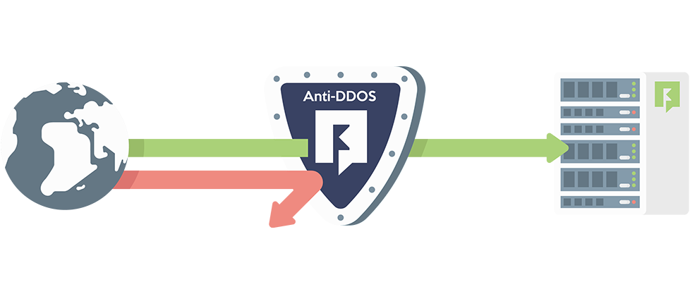
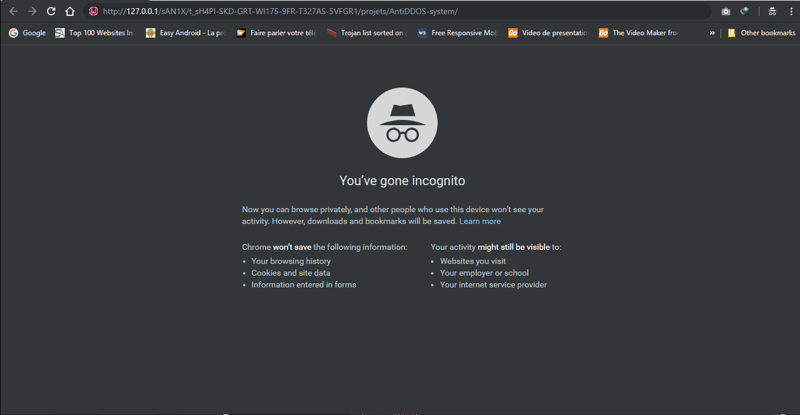
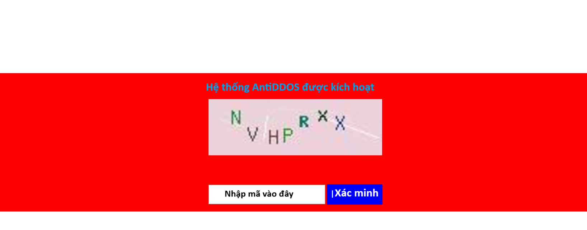

<h1>SystemAntiDDOS</h1>
Một cách đơn giản để bảo vệ ứng dụng web của bạn khỏi cuộc tấn công DDOS (MIỄN PHÍ) trong *1 dòng*.

## Nó hoạt động như thế nào?

Tại mỗi kết nối, hệ thống tạm thời lưu địa chỉ IP của máy khách và theo dõi tần số kết nối của nó, nếu tần số kết nối này bất thường thì hệ thống coi đó là địa chỉ IP xấu và gửi yêu cầu xác minh dưới dạng xác minh. Captcha được tích hợp vào hệ thống, nếu vượt qua bước kiểm tra này thì đó là con người chứ không phải robot!
### Testing...


**"Dự án này đã được thử nghiệm bởi phần mềm Somes ddos ​​với số điểm 77%."**
## Làm thế nào để sử dụng nó?

### SỬ DỤNG cơ bản
```php
<?php
	include ("anti_ddos/start.php"); //viết cái này lên đầu ứng dụng PHP của bạn và tất cả đã hoàn tất!!!
?>
<!DOCTYPE html>
<html>
<head>
	<title>
		Ví dụ trang Web được bảo vệ!
	</title>
</head>
	<body>
		...
		<h2>Ví dụ trang Web được bảo vệ!</h2>
		...
	</body>
</html>
```

### SỬ DỤNG nâng cao:
```php
<?php
	try{
		if (!file_exists('anti_ddos/start.php'))
			throw new Exception ('anti_ddos/start.php không tồn tại');
		else
			require_once('anti_ddos/start.php'); 
	} 
	//CATCH ngoại lệ nếu có sự cố.
	catch (Exception $ex) {
		// và in một thông báo nói rằng có lỗi
		echo '<div style="padding:10px;color:white;position:fixed;top:0;left:0;width:100%;background:black;text-align:center;">The <a href="https://github.com/bibo318/SystemAntiDDOS" target="_blank">"Hệ thống AntiDDOS"</a> không tải đúng cách trên Trang web này, vui lòng bỏ nhận xét \'catch Exception\' để xem chuyện gì đang xảy ra!</div>';
		//In ra thông báo ngoại lệ.
		//echo $ex->getMessage();
	}
	// cp -r SystemAntiDDOS/ /var/www/html/
?>
---- NỘI DUNG TRANG HTML ----
```


## Tác giả

- [Debugs](https://github.com/bibo318)

## LICENSE

[MIT License](https://github.com/bibo318/SystemAntiDDOS/blob/master/LICENSE)

PS: Hãy cho mình 1 Ngoi sao nhe ! ;-)

